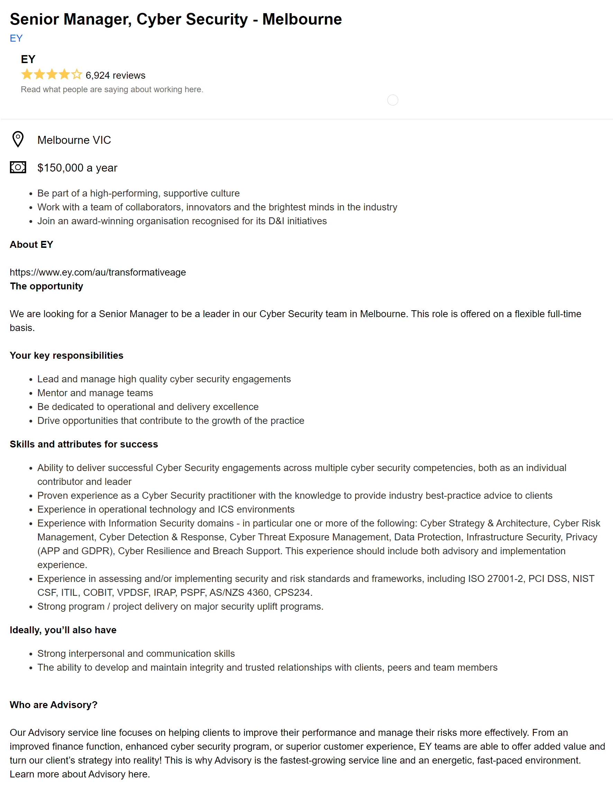
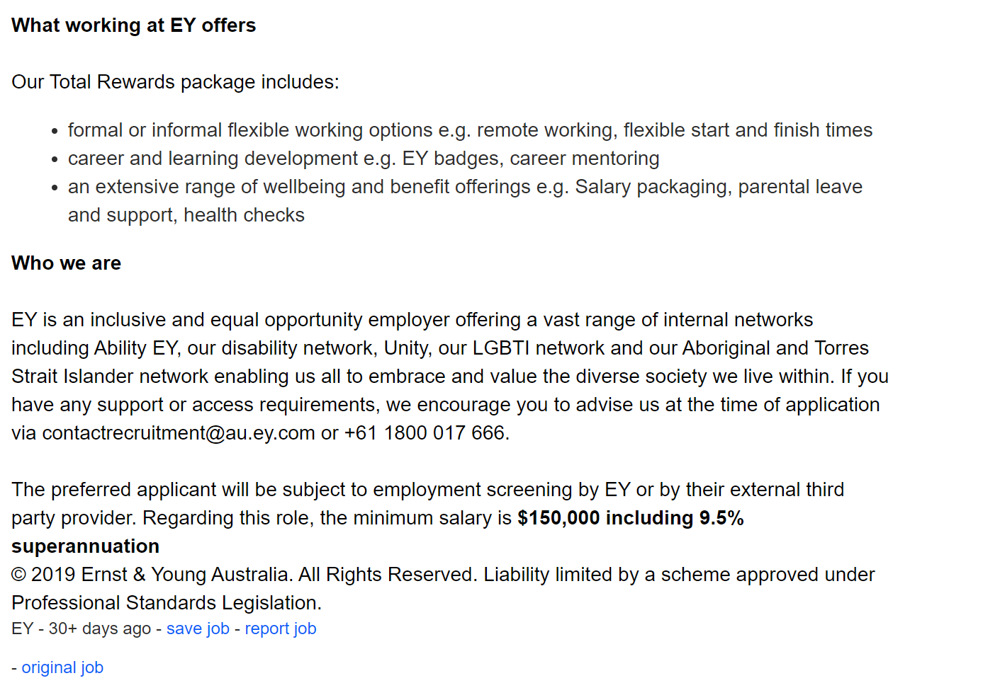

[Link to my site](https://vigmen2108.github.io/IIT_ass1/)

 

# Interest in IT
My interest in Information Technology began when I was doing my first bachelors which involved some coding as fundamentals for Electrical Engineering. Initially IT was forced on to me although I disliked it very much purely because coming from an Indian social circle, many of my mates and my family friends were in IT field and I really didn’t like what they did for a living. But soon I came to realise that IT is everywhere and its everything. It’s innovation, its creation and its history. Let me explain… IT allows you to make progress in leaps and bounds relative to anything we have seen in the past, creating things we only dreamt of in the past – MRI machines, Virtual reality, smart home systems like in Iron Man movies. This is a direct result of the things we have learn through out history which is leading our drive towards innovation and the freedom we have allows us to create whatever our heart desires. This brought out a whole new perspective in me – to be in the leading edge of innovation, if not at least be up to date with the latest trends and technology – move forward with the world. My experiences with IT are adequate – I have done courses in C, Java and I have self-taught VBA and python. I have also used Verilog which is a hardware description language used in my previous degree.
Honestly, I chose RMIT because I knew mates who went to RMIT when I was studying in University of Melbourne and highly recommended it. Moreover, RMIT being one of the few universities that offer IT and knowing its reputation, made it an easy decision when I was looking for a course through Open Universities Australia.
I expect to become proficient at a few more coding languages, build on my existing skills. I would like to gain an appreciation for new technologies in this ever-changing field. Finally, I would like to have a degree in IT that would help me advance in my current workplace or shift my experience and knowledge to the private sector in order to progress my career.

# Ideal Job
[Link to the job ad](https://au.indeed.com/viewjob?jk=4492d49e9b3cbe8b&tk=1drsjg8qkb9h7800&from=serp&vjs=3)

 

 
 
## Description:
The position of the Senior Cyber Security Manger is to leader a team of cyber security specialists at EY. The role from my understanding requires prior experience in both leadership and management but also technical expertise in cyber security. The job advertised lists the things that is required in the applicant which’ll allow the m to be successful in this role, lists the risk management framework they must be competent in and finally lists the extra attributes they must possess such as good communication and interpersonal skills which is vital for a senior position. Moreover, this position requires you to have a intimate understanding of the job as well as be able to lead junior members through their roles – mentoring and managing their needs. This can be challenging and rewarding at the same time hence the job appeals to me because when I progress through my career, I’d like to continue doing my job that I started off with, continue doing the role I felt passionate about while using my experience and knowledge to coach newer members of the team and guide them towards the gaols of the company that I’d come to understand through my experiences.

## Skills and Qualifications:

